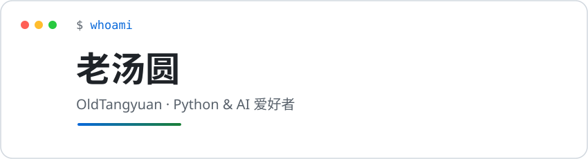

<!--
  ============================================
  OldTangyuan · 老汤圆 个人主页 README
  极简科技风 · 双主题（深色/浅色自动切换）
  ▸ 需要替换的信息都已在文中用注释标出
  ============================================
-->

<picture>
  <source media="(prefers-color-scheme: dark)" srcset="assets/banner-dark.svg">
  <source media="(prefers-color-scheme: light)" srcset="assets/banner-light.svg">
  
</picture>

## 👋 你好，我是老汤圆

一名**大学生**，Python 开发者与技术爱好者，喜欢用代码把想法变成现实。

- 🐍 主力语言 **Python**，也会 C、JavaScript、HTML
- 🤖 关注 AI & LLM、爬虫，偶尔用 Godot 做点小游戏
- ⚡ 爱好：把复杂的问题简单化

<!-- 如需增删介绍，直接编辑上面的列表即可 -->

## 🛠 技术栈

<!-- ↓↓↓ 按你的实际情况增删 / 修改徽章即可 ↓↓↓ -->

### 编程语言

  
  
  
  

### AI 与探索

  
  
  

### 数据与工具

  
  
  
  
  
  

## 📊 GitHub 数据

<!--
  以下卡片来自第三方开源项目，自动读取你仓库的真实数据：
  · github-readme-stats          https://github.com/anuraghazra/github-readme-stats
  · github-readme-streak-stats   https://github.com/DenverCoder1/github-readme-streak-stats
  · github-readme-activity-graph https://github.com/Ashutosh00710/github-readme-activity-graph
-->

  <picture>
    <source media="(prefers-color-scheme: dark)" srcset="https://github-readme-stats.vercel.app/api?username=OldTangyuan&show_icons=true&hide_border=true&theme=github_dark&locale=zh-cn">
    
  </picture>
  &nbsp;&nbsp;
  <picture>
    <source media="(prefers-color-scheme: dark)" srcset="https://streak-stats.demolab.com/?user=OldTangyuan&theme=dark&hide_border=true">
    
  </picture>

  <picture>
    <source media="(prefers-color-scheme: dark)" srcset="https://github-readme-activity-graph.vercel.app/graph?username=OldTangyuan&theme=github-dark&hide_border=true">
    
  </picture>

  <picture>
    <source media="(prefers-color-scheme: dark)" srcset="https://github-readme-stats.vercel.app/api/top-langs/?username=OldTangyuan&layout=compact&hide_border=true&theme=github_dark&locale=zh-cn">
    
  </picture>

## 📫 联系我

<!-- ↓↓↓ 联系方式（如需增删，直接编辑下面的链接）↓↓↓ -->

  
  
  

---

⭐ 如果我的项目对你有帮助，欢迎 Star

